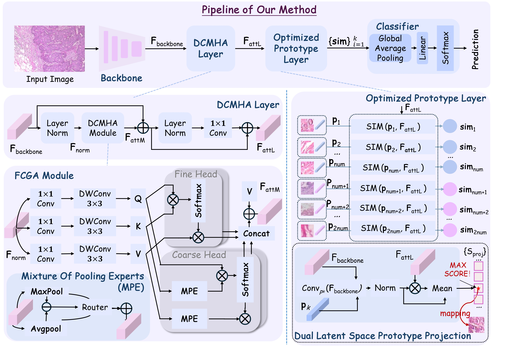

# DGMHA-OPF

**"Towards Interpretable and Accurate Breast Cancer Classification via Dual-Granularity Attention and Optimized Prototype Learning"**

---

## 📝 Abstract

As the most common malignancy in women, breast cancer demands early and accurate detection. While deep learning systems now assist radiologists with imaging diagnostics, their widespread adoption is hindered by the persistent trade-off between achieving high diagnostic accuracy and providing meaningful interpretability.
In response, we present a novel framework that jointly enhances discriminative capability and model transparency by integrating an attention-enrichment strategy with prototype-based interpretability. Central to our method is the Dual-Granularity Multi-Head Attention module, which explicitly models both coarse- and fine-grained long-range dependencies, thereby improving the expressiveness of visual representations. Complementing this, we introduce a Dual Latent Space Prototype Projection mechanism that exploits the shallow embedding space derived from the backbone network and the deep embedding space produced by our attention-enhanced features. This dual-space alignment enables a more precise association between learned prototypes and semantically representative training image patches, facilitating faithful explanations. Extensive experiments on the BreaKHis breast cancer dataset demonstrate that our approach consistently outperforms state-of-the-art baselines in classification accuracy while delivering interpretable and intuitively aligned visual explanations.

---

## 🖼️ Framework Overview



---

## 📦 Installation

```bash
git clone https://github.com/Frank-Cai0709/DGMHA-OPF.git
cd DGMHA-OPF

# Create virtual environment
conda create -n ours_env python=3.10
conda activate ours_env
