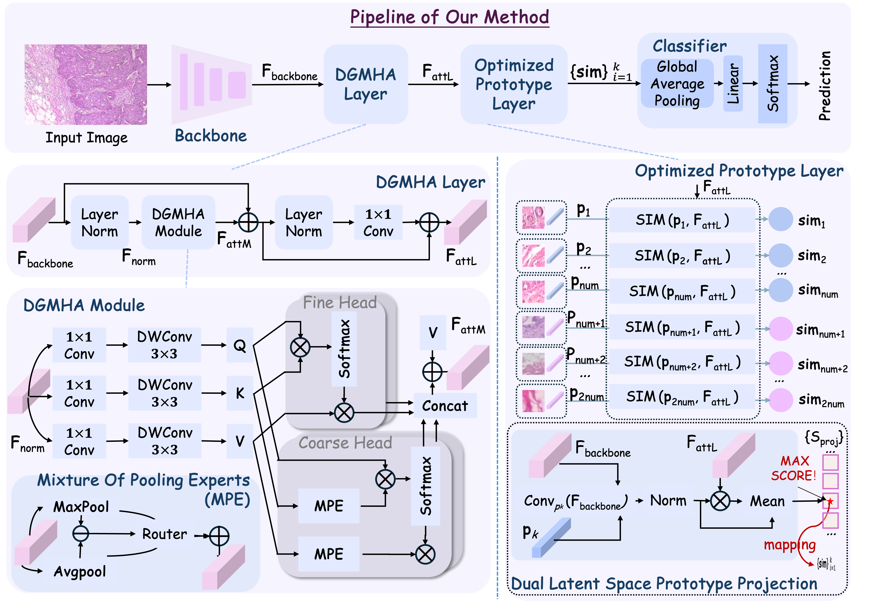

# DGMHA-OPF

**"Towards Interpretable and Accurate Breast Cancer Classification via Dual-Granularity Attention and Optimized Prototype Learning"**

---

## 📝 Abstract

Breast cancer remains the most prevalent malignancy among women globally, underscoring the critical importance of early detection and accurate classification. However, existing deep learning-based computer-aided diagnosis (CAD) systems often struggle to strike a balance between high classification accuracy and interpretability.

To address this trade-off, we propose **DGMHA-OPF**, a novel framework that synergistically combines attention-enhanced feature representation with prototype-based interpretability.

- We design a **Dual-Granularity Multi-Head Attention (DGMHA)** module to capture both coarse- and fine-grained long-range dependencies, thereby enriching feature expressiveness.
- For enhanced interpretability, we introduce a **Dual Latent Space Prototype Projection** mechanism that jointly leverages:
  - the shallow embedding space from the backbone, and  
  - the deep embedding space from the attention-enhanced layers,  
  enabling more precise mapping between prototypes and representative training patches.

Extensive experiments on the **BreaKHis** dataset demonstrate that our method achieves **superior classification accuracy** while providing **faithful and intuitive visual explanations**, showcasing its potential for practical breast cancer diagnosis.

---

## 🖼️ Framework Overview



---

## 📦 Installation

```bash
git clone https://github.com/Frank-Cai0709/DGMHA-ProtoNet.git
cd DGMHA-ProtoNet

# Create virtual environment
conda create -n dgmha_env python=3.10
conda activate dgmha_env
